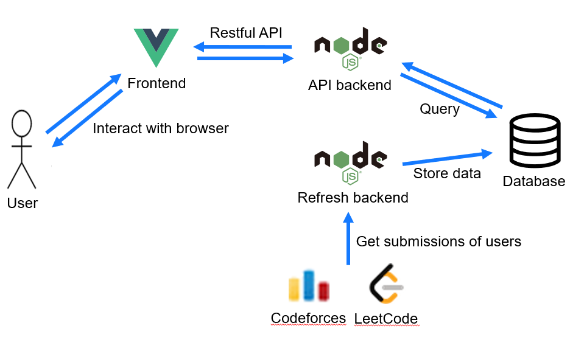
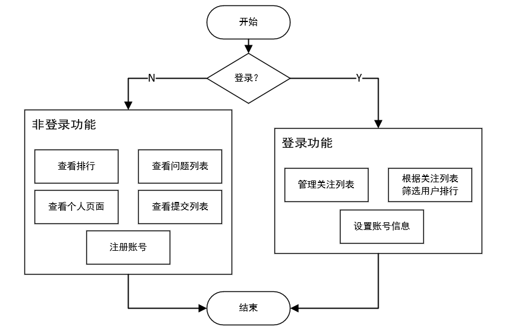

# ACMTrainingTeamPlatform

### 介绍
ACM集训队平台。每小时更新用户在Codeforces和LeetCode平台上的提交情况，形成每日排名和个人图表分析，并且可以管理多个关注用户列表，对排名进行筛选。

### 架构



### 功能



### 本地调试

#### 前端

frontend文件夹内

安装依赖包：`npm install`

启动服务器：`npm run serve`

打包：`npm run build`

#### 后端

backend文件夹内

与数据库连接的配置文件：[backend.js](backend/config/development.js)

安装所有依赖包：`npm install`

启动服务器：`npm run serve`

打包：`npm run build`

#### 数据库

使用mysql数据库，表的创建可运行[schema.sql](./docker-compose/schema.sql)。

### docker部署

前置要求：安装`docker`

1. 首先克隆项目或下载zip并解压：

   `git clone https://gitee.com/wu_sheng_hao/acmtrainingteam-platform.git`

2. 然后进入`docker-compose`目录，并运行docker compose：

```shell
cd ./docker-compose
docker compose up -d
```

在`docker-compose`目录内，这一命令会下载对应的镜像并根据`docker-compose.yml`的配置执行构建，详情请查看该文件，下面简要介绍docker构建原理：

- 数据库基于[mysql:8.0.31镜像](https://hub.docker.com/_/mysql)，第一次启动时会运行[schema.sql](./docker-compose/schema.sql)中的代码。会将数据持久化储存在项目目录下的`/docker-compose/mysql`文件夹内（项目部署成功后可看到该文件夹被创建），并暴露3306端口（此端口只可被docker-compose内部网络访问）供后端连接。
- 后端和定期刷新容器基于[node:16.19.0镜像](https://hub.docker.com/_/node)，并基于`backend/dist`文件夹中的[backend.js](backend/dist/backend.js)和[refresh.js](backend/dist/refresh.js)，并开启5000端口供前端请求。
- 前端基于[nginx:1.23.3](https://hub.docker.com/_/nginx)镜像，并基于`frontend/dist`文件夹进行前端部署，部署于80端口，配置文件为[nginx_container.conf](./docker-compose/nginx_container.conf)。

执行完毕后，等待一会后，打开`localhost`便可以看到部署完成的平台。暴露于80端口。

**注意：**当使用云服务器部署时，请开启服务器的80端口和5000端口使外部可以访问。